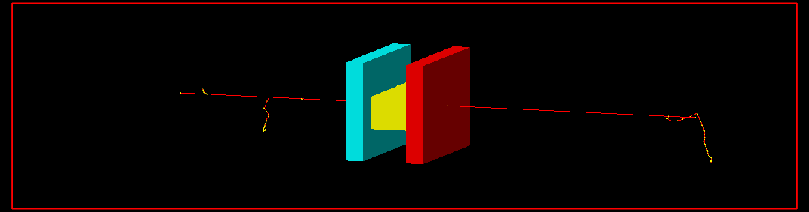

# Simulation of a simple lab experiment using Geant4


# Building

``` sh
mkdir build && cd build
cmake ..
make
./muon_lab
```

# Dependecies
- [Geant4](https://geant4.web.cern.ch/) 
- [ROOT](https://root.cern/) (OPTIONAL)
